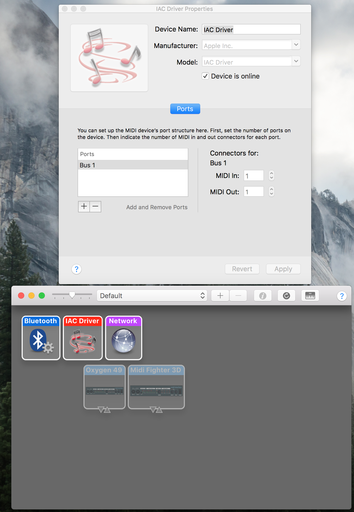

# Artist App Python Client
This python script instantiates a pubnub instance that is subscribed to the accelerometer data streaming from the aggregated values in PubNub functions.

The python script also enables buttons on the client phone app to trigger midi commands mapped to ableton.

# Usage Instructions

1.) When working with Python, it is highly recommended to use virtual environments to isolate python versions and package dependancies. I like to use Anaconda, which supplies its own distribution of Python. Download and install the Python 3.6 version of Anaconda (you can specify a conda environment after installation to use python 2.7 instead of python 3.6)

https://www.continuum.io/downloads

2.) Restart terminal so that the $PATH associated with Anaconda installation are updated.

3.) Create a new conda environment, let's call it "outsidelands"

`conda create --name outsidelands`

Hit yes to install the dependancies

4.) Activate the environment
  
`source activate outsidelands`

5.) Terminal should now have the environment name prefixed to the left

6.) Check python version by running:

`python`

It should say python 3.6

7.) Install [mido](https://mido.readthedocs.io/en/latest/) (a midi I/O library)

`pip install mido`

Then install rt-midi to access the ports of connected IO MIDI devices

`pip install python-rtmidi`

8.) Install [pubnub](https://www.pubnub.com/docs/python/pubnub-python-sdk) (real-time datastream network)

`pip install 'pubnub>=4.0.13'`

9.) Navigate to directory containing the code
`cd artist_app/client_code`

10.) Ensure that the "IAC Driver" is enabled in MacOS' "Audio MIDI Preferences"

11.) Run the python script
`python SubscriberTest.py`

By default, the python script will print out messages into the console.
